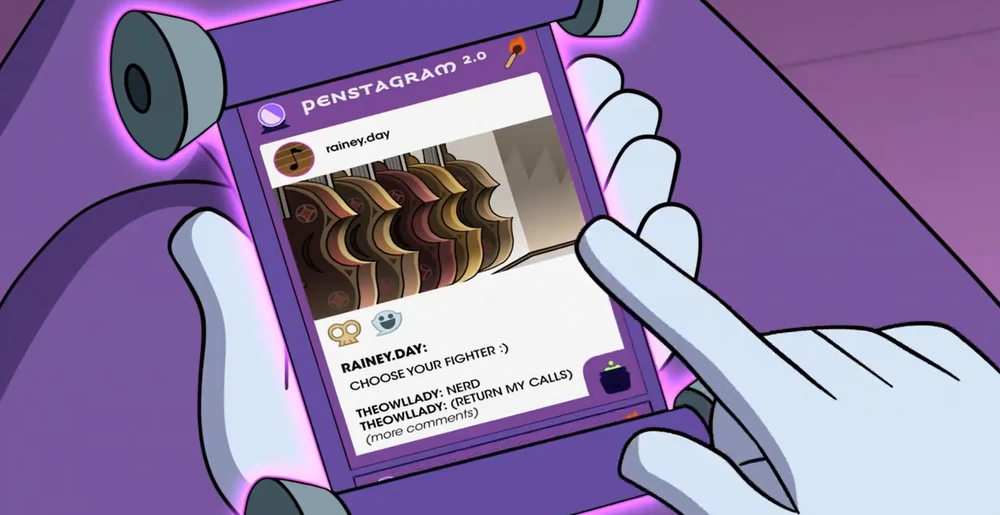

# Penstagram 2.0

$$\text{\Large \textit{A fake social media app by MemoryOverload}}$$

## What is Penstagram 2.0?
Well, on *The Owl House*, Penstagram 2.0 (or .02, or no release suffix, depending on the episode) is a social media app on a person's scroll where the general populace of the Boiling Isles can share posts in the forms of text, picture, and video about their day-to-day life. Alongside public posts, users can also have private conversations between themself and another user.



$$\text{\small Photo: \textit{The Owl House}, "Any Sport In A Storm"}$$

In terms of color scheme, the main palette consists of a purple border on a white backdrop. with the Penstagram logo at the top of the screem, accompanied by a crystal ball emoji and a burning match emoji. In the bottom rught, a cauldron emokji can also be seen, which is likely what a user taps if they want to cook up a new post. *Eh, see what I did there? Sorry, I'll stop.*

## Okay, but why post this on AO3?
Well, the long and short of it is that I wanted to do something that can combine my two passinos: coding and the funny gay owl show. Plus, AO3's limitations on accepted HTML tags means that I also have a challenge of doing all this a limited tag set. (The most annoying of all: no buttons.)

## Can I Make My Own Version of Penstagram 2.0?
Be my guest! I'm making this under a GNU General Public License 3.0 (GPL 3.0, for short), which means that anyone and everyone can copy, modify, or do whatever to this project. Heck, you can even sell this as a product, or even patent it!

To make a lot of legalese short, go wild and have fun with this. Make it your own!

## Let's Get Down To The Nitty Gritty: The Code
They (Who is 'they'? I dunnno.) say that all good things come in threes, so I'll break this code section up by the three main languages used: HTML, CSS, and Python. Let's kick things off by talking about the meat and potatoes of this project: HTML.

### HTML
[HyperText Markup Language (HTML)](https://en.wikipedia.org/wiki/HTML) is a language used in web design that basically lays out how objects are displayed on the screen. There are many different elements that one can choose from in HTML, but I'm keeping this project relatively simple in what types are used: paragraphs (`<p>`), divs (`<div>`), headers (`<h1> - <h6>`), and lists (`<ul>` for the list itself, `<li>` for each list item). One thing you have to be really careful about in HTML is closing your tags properly. Whenever you have a paragraph (`<p>`) for instance, when that paragraph is done, be sure to close it by ending the line with a close paragraph tag (`</p>`). The way to tell which tags are open tgs and which are close tags is by the presence of a slash after the < sign.

Hold on...

I'm forgetting something...

Oh yeah, anchors!

The anchor tag (`<a>`) is what ties Penstagram 2.0 together. Anchor tags are what is used when you are clicking on a link to another webpage or a section of a webpage you're already on. That link up there? The blue thing saying `HyperText Markup Language (HTML)`? That's what an anchor tag does. (Well, it's technically a markdown representation of an anchor tag, but potato tomato.) When you click on that blue text, it takes you to the Wikipedia page for HTML. Neat, right?

Okay, so know that we know all tha main tags used in the HTML, how does it work?

I like to think of Penstagram 2.0 as a bunch of pages that are all linked together by those anchor tags, and they are all bundled together in one big `<div>` tag called `main`.

Inside `main` is all of the `page`s. Each page has a unique id, usually in the form of `#[page descriptor]_[name of the current user]` that is tacked on the end of the web URL. For example, if we were looking at @foobar123's account profile when logged in as Eda, it would be under `#foobar123_profile_eda`.

This is where anchors come in to play. Since this project is replicating Penstagram, and you can't just scroll through every single page in existence in one cotinuous stream, you have to break things up. This is why anchors are so important, as they both allow the user to select where they want to go, and tell the app what location the user just requested.

If you look at the top of each div with a class of `page`, you will see an anchor tag just above them with a name that corresponds to the content of the page. this is how users can jump around Penstagram 2.0 instead of having to scroll through every page on the app.

### CSS
The easiest way to describe [Cascading Style Sheets (CSS)](https://en.wikipedia.org/wiki/CSS) is that it looks at the HTML code it is associatde with and changes how certain elements appear on screen.

Let's do an example. Assume we have this boring looking paragraph here:

<p>Hi, I'm in a paragraph tag!</p>

(Code: ```<p>Hi, I'm in a paragraph tag!</p>```)

There is nothing special about that paragraph, so let's add some color to make it stand out!

<p style="color:green;">Hi, I'm in a paragraph tag, but now I have <em>style</em>!</p>

(Code: ```<p style="color:green;">Hi, I'm in a paragraph tag, but now I have <em>style</em>!</p>```)

Notice how the second `<p>` has that `style="color:green;"` thing in it? That is CSS in action.

### Python
[Python](https://en.wikipedia.org/wiki/Python_(programming_language)) is the one "real" programming language that I'm going to be using in this project.