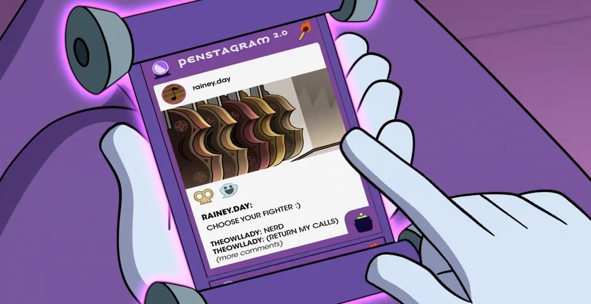
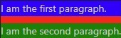

# Penstagram 2.0

$$\text{\large \textit{A fake social media app by MemoryOverload}}$$

## What is Penstagram 2.0?
Well, on *The Owl House*, Penstagram 2.0 (or .02, or no release suffix, depending on the episode) is a social media app on a person's scroll where the general populace of the Boiling Isles can share posts in the forms of text, picture, and video about their day-to-day life. Alongside public posts, users can also have private conversations between themself and another user.



$$\text{\small Photo: \textit{The Owl House}, "Any Sport In A Storm"}$$

In terms of color scheme, the main palette consists of a purple border on a white backdrop. with the Penstagram logo at the top of the screem, accompanied by a crystal ball emoji and a burning match emoji. In the bottom right, a cauldron emoji can also be seen, which is likely what a user taps if they want to cook up a new post. *Eh, see what I did there? Sorry, I'll stop.*

## Okay, but why post this on AO3?
Well, the long and short of it is that I wanted to do something that can combine my two passinos: coding and the funny gay owl show. Plus, AO3's limitations on accepted HTML tags means that I also have a challenge of doing all this a limited tag set. (The most annoying of all: no buttons.)

## Can I Make My Own Version of Penstagram 2.0?
Be my guest! I'm making this under a GNU General Public License 3.0 (GPL 3.0, for short), which means that anyone and everyone can copy, modify, or do whatever to this project. Heck, you can even sell this as a product, or even patent it!

To make a lot of legalese short, go wild and have fun with this. Make it your own!

## Let's Get Down To The Nitty Gritty: The Code
They (Who is 'they'? I dunnno.) say that all good things come in threes, so I'll break this code section up by the three main languages used: HTML, CSS, and Python. Let's kick things off by talking about the meat and potatoes of this project: HTML.

### HTML
[HyperText Markup Language (HTML)](https://en.wikipedia.org/wiki/HTML) is a language used in web design that basically lays out how objects are displayed on the screen. There are many different elements that one can choose from in HTML, but I'm keeping this project relatively simple in what types are used: paragraphs (`<p>`), divs (`<div>`), headers (`<h1> - <h6>`), and lists (`<ul>` for the list itself, `<li>` for each list item). One thing you have to be really careful about in HTML is closing your tags properly. Whenever you have a paragraph (`<p>`) for instance, when that paragraph is done, be sure to close it by ending the line with a close paragraph tag (`</p>`). The way to tell which tags are open tgs and which are close tags is by the presence of a slash after the < sign.

Hold on...

I'm forgetting something...

Oh yeah, anchors!

The anchor tag (`<a>`) is what ties Penstagram 2.0 together. Anchor tags are what is used when you are clicking on a link to another webpage or a section of a webpage you're already on. That link up there? The blue thing saying `HyperText Markup Language (HTML)`? That's what an anchor tag does. (Well, it's technically a markdown representation of an anchor tag, but potato tomato.) When you click on that blue text, it takes you to the Wikipedia page for HTML. Neat, right?

Okay, so know that we know all tha main tags used in the HTML, how does it work?

I like to think of Penstagram 2.0 as a bunch of pages that are all linked together by those anchor tags, and they are all bundled together in one big `<div>` tag called `main`.

Inside `main` is all of the `page`s. Each page has a unique id, usually in the form of `#[page descriptor]_[name of the current user]` that is tacked on the end of the web URL. For example, if we were looking at @foobar123's account profile when logged in as Eda, it would be under `#foobar123_profile_eda`.

This is where anchors come in to play. Since this project is replicating Penstagram, and you can't just scroll through every single page in existence in one cotinuous stream, you have to break things up. This is why anchors are so important, as they both allow the user to select where they want to go, and tell the app what location the user just requested.

If you look at the top of each div with a class of `page`, you will see an anchor tag just above them with a name that corresponds to the content of the page. This is how users can jump around Penstagram 2.0 instead of having to scroll through every page on the app.

Now that you hopefully have a better undrestanding of the structuring of Penstagram 2.0, let's talk about how we actually make this look like an app: CSS.

### CSS
The easiest way to describe [Cascading Style Sheets (CSS)](https://en.wikipedia.org/wiki/CSS) is that it looks at the HTML code it is associatde with and changes how certain elements appear on screen.

Let's do an example. Assume we have this boring looking paragraph here:

<p>Hi, I'm in a paragraph tag!</p>

In actual code, this looks like:

``` html
<p>Hi, I'm in a paragraph tag!</p>
```

There is nothing special about that paragraph, so let's add some color to make it stand out!

<p style="color:green;">Hi, I'm in a paragraph tag, but now I have <em>style</em>!</p>

Now, let's look at how the code changed.

``` html
<p style="color:green;">Hi, I'm in a paragraph tag, but now I have <em>style</em>!</p>
```

**[EDIT: Since GitHub doesn't like fun, colorful text, the paragraph above doesn't appear as green. Just imagine the text is green. Ok thanks, bye.]**

Notice how the second `<p>` has that `style="color:green;"` thing in it? That is CSS in action.

But there is a prpblem here. When you paste in your HTML code into the AO3 text editor, all the `style` things you added in get deleted. Bummer.

However, AO3 *does* actually allow you to apply CSS to your story. Introducing: Work Skins!

Work skins are pages separate to the main story, but can be associated to a story/a set of stories. Work skins are formatted as CSS files.

'How are CSS files formatted, then?' you might ask. Once again, let's look at an example.

Assume I have these two paragraphs inside a parent div element.

<div>
  <p>I am the first paragraph.</p>
  <p>I am the second paragraph.</p>
</div>

The code for this looks like:
``` html
  <div>
    <p>I am the first paragraph.</p>
    <p>I am the second paragraph.</p>
  </div>
```

Now let's say we want to make the first paragraph have a blue background, the second to have a green background, and the overall div to have a red background. Since we can't use "style:", we have to use the work skin to hold the CSS rules we want to apply.

We only have one div, so that's perfectly fine to reference just by it's type. However, since we have two pargraphs and we want to differentiate them, let's give them unique classes, like so:

``` html
<div>
  <p class="one">I am the first paragraph.</p>
  <p class="two">I am the second paragraph.</p>
</div>
```

Now, let's open up the separate file that will hold the CSS rules and will act as the work skin. It will initially be blank, so let's add our first rule: making the div have a red background.

We can do that like so:

``` css
div {
  background-color: red;
}
```

This will make every div that the CSS encounters have a red background (unless there is something more specific than a plain ol div that says otherwise).

Now that our div will have a red background, let's give paragraph one its blue background.

``` css
div {
  background-color: red;
}

p.one {
  background-color: blue;
}
```

See that `p.one`? That means that that rule will noly apply if the element is both a paragraph (`<p>`) *and* belongs to the class "one", which our first paragraph does.

Now all that is left to do is to give paragraph two its green background. If we wanted to be bad programmers, we could do something like this:
``` css
div {
  background-color: red;
}

p {
  background-color: green;
}

p.one {
  background-color: blue;
}
```

This would technically do what we want, since the p.one class would override the default p rule for paragraph one, but that is not good practice. We gave paragraph two a class, so let's use it.

A better version would look like this:

``` css
div {
  background-color: red;
}

p.one {
  background-color: blue;
}

p.two {
  background-color: green;
}
```

This way, only paragraphs with class "one" and "two" are edited and any other paragraphs we add in the future will be normal and unformatted, which is what we want in this case.

Finally we get our desired result of this lovely eyesore:



(Sorry for the poor image quality.)

Alright, tangent about coloring paragraphs aside, let's discuss some of the more fun things that Penstagram 2.0 uses CSS-wise, like how carefully controlling `overflow` allows the fake scroll to, well, scroll.

Put simply, `overflow` determines whether or not you can scroll within an element in the horiztonal/vertical direction if the element overflows its normal bounds.

The two most interesting places this rule is used is within the `main` div and the descendant `page` divs.

Inside the `main` div, overflow is set to `hidden`. This means that, try as you might, you can't scroll around the main div. The main div is also what has the big purple border around it. This is so that, if a user is on one page, they can't just scroll to another page down the line.

Pages, on the other hand, have an overflow-y of `auto`. This means that the user can't scroll horizontally, but if there is enough content that the screen overflows vertically, then a scrollbar will appear and the user can scroll *within* the page. This is best shown off when looking at one of the feed pages. The only way someone would be able to read all of the text there while staying within the confines of the main div would be if a scrollbar appears, and so one does, allowing the user to see all my half-baked attempts at humor. 

### Python
[Python](https://en.wikipedia.org/wiki/Python_(programming_language)) is the one "real" programming language that I'm going to be using in this project. While the Python files in this codebase don't directly contribute to how Penstagram 2.0 looks or feels, they help by eliminating a lot of typing that would otherwise leave my fingers cramping after just a few pages.

The one I find myself using most often is `feed_generator.py`. This is the first file I came up with when I relaized I could use Python to automate a lot of the typing I would otherwise dread doing.

It's a simple program, all things considered.

First, you define what the posts are giong to be. They have three components: the author, the message, and the time the message was sent.

The way I have the function set up, there is one megalist of all the posts, inside of which are smaller lists that contain the three pieces of data needed to create the post on Penstagram 2.0.

But before we do that, we need to do a small bit of housekeeping. Each page on Penstagram 2.0 has a header that contains the app's logo, which, when clicked/tapped, retrns the user to the feed.

the good news is that this function is used to create the feed, so we just have to add an empty anchor tag before the page div so the other anchors know where to jump to.

``` python
string: str = f"""
<a name="{current_user}" rel="nofollow" id="{current_user}"></a>"""
```

One of the really nifty things about strings in Python is that you can use fstrings (or formatted strings if you want to be fancy) to insert the value of a variable into a string. This is why there are those `{current_user}` things inside the anchor. When the entire string gets printed out, it will actually show the user's name, like `Eda` or `Raine` or `Joe Bob Window`, whatever the name may be.

After the header, there is the switch profile button, which is a constant, so that can just be hard coded in, easy peasy.

```python
string += f"""
<div class="page">
  <h1 class="header">
    <a class="logo" href="#{current_user}" rel="nofollow">Penstagram<sub><sub>2.0</sub></sub></a>
  </h1>
  <p>
    <a href="#login" class="switch_profile" rel="nofollow">SWITCH PROFILE</a>
  </p>"""
```

After that, though, is where the loop comes in.

Remember that megalist of posts I mentioned? This is where that bad boy comes in to play. Another really nice thing about Python is that it can unpack elements of a list into individual variables.

That's why I can do something like:

``` python
for author, message, time in posts:
```

What happens here is that the loop first grabs the list that is at whatever index in the megalist, which represents one post on the timleine. Then, the elements of that list that jiust got grabbed are pulled out into separate variables. This allows for the easy-ish task of just typing out where each variable goes in the HTML, resulting in this:

```python
for author, message, time in posts:
    post_to_add = f"""
  <p class="post"><span class="post_author"><b><a href="#{author}_profile_{current_user}" rel="nofollow">{author}</a></b> {time}<br /></span>
    {message}
  </p>"""
    string += shared_functions.replace_tags(post_to_add, current_user)
```

You may notice that call to replace_tags. That just uses a regular expression to look through the message of the post. If it sees anything that matches the formatting of a tag (`@DanaTerrace`, for example), then it replaces that with a specially designed anchor tag that is formatted to stand out aginst the rest of the message.

Once the first post is accounted for, the loop then grabs the next post and repeats the process until there are none left.

Finally, a `div` tag is added at the end to close off the page.

Let's take this baby for a test run. `current_user` will be `mo`, and the two post will be both from the user `Memoryoverload` at 12:00 AM, saying "This is an example." in one and "Subscribe to @DanaTerrace" in the other.

``` html
<a name="mo" rel="nofollow" id="mo"></a>
<div class="page">
  <h1 class="header">
    <a class="logo" href="#mo" rel="nofollow">Penstagram<sub><sub>2.0</sub></sub></a>
  </h1>
  <p>
    <a href="#login" class="switch_profile" rel="nofollow">SWITCH PROFILE</a>
  </p>
  <p class="post"><span class="post_author"><b><a href="#MemoryOverload_profile_mo" rel="nofollow">MemoryOverload</a></b> 12:00 AM<br /></span>
    This is an example
  </p>
  <p class="post"><span class="post_author"><b><a href="#MemoryOverload_profile_mo" rel="nofollow">MemoryOverload</a></b> 12:00 AM<br /></span>
    Subscribe to <a href="#DanaTerrace_profile_mo" class="tag" rel="nofollow">@DanaTerrace</a>
  </p>
</div>
```

There are other generators that were also made, but they follow roughly the same basic outline, so you can figure out how those work on your own.

### Thank you, have fun, and remember that us weirdos have to stick together!